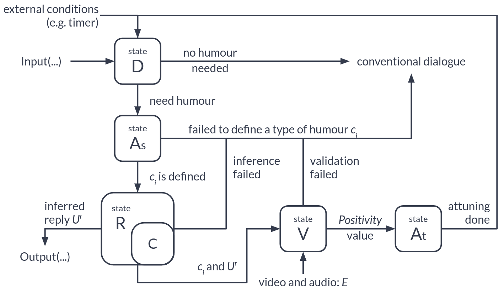
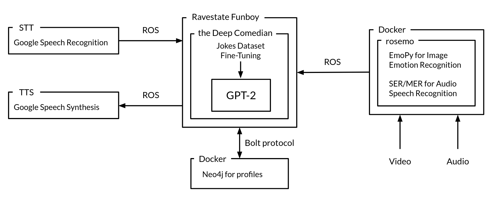

# Funboy: DARVAH for Human-Robot Interaction

This repository provides all main and supplementary files and source code for the master thesis *Funboy: Deducing, 
Assessing, Rendering, Validating and Attuning Humor in a Natural Language Dialogue for Human-Robot Interaction*
carried out at [Roboy](https://roboy.org/) and [the Technical University of Munich](https://www.tum.de/) in 
Summer Semester 2019 / Winter Semester 2019-2020.


```
    ______  _____    ______  __    _______    __    __            ______     
   / /  \ \/ / \ \  / /  \ \/ /   / _\/ \ \  / /   / _\   /     / /     / /
  / /   / / /   \ \/ /___/_/ /   / / /   \ \/ /___/ /    /_____/ /_____/ /
 / /   / / /____/ / /  \ \/ /   / / /____/ / / \_/ /    /     / /    \  /
/ /___/ / /\___/ / /   / / /___/ / /\___/ / /   / /    /     / /     / / 
\/ \___/\/    /_/\/    \_\______/\/    /_/\/   /_/    _________________
                                    
```

## Abstract

More and more modern robots can perform various social functions such as maintaining a sustained conversation in natural 
languages. However, current Human-Robot Interaction experience in Natural Language Dialogues is still far from perfect.
We assume that for better interaction, we need to endow our robots with higher-level functionality – such as humour 
generation capabilities. In this thesis, we decided to explore how people would react to robots that can produce 
humorous remarks in a sustained conversation. Given the current state-of-the-art in Language Models, we conditioned 
one of them using jokes collected over online sources and proposed a Natural Language Dialogue framework - 
DARVAH for Natural Language Generation tasks providing humorous responses in a conversation. We implemented 
the DARVAH framework in the Funboy module of the Ravestate Dialogue System. The module is capable of generating 
humorous responses, evaluating emotions of conversation partners and validating the generated humorous output 
accordingly. We used the implementation to carry out a proof-of-concept experiment that revealed how people react 
to a joking humanoid robot. The conducted experiment demonstrated great prospects for improving HRI experience 
via humour-enabled Dialogue Systems. However, further research and experimental evaluation are necessary 
to collect more data and unlock the full potential of the DARVAH framework.

## DARVAH Description

DARVAH system is a loop comprising five stages:
1. *D* stands for "deduce" and is a state that decides whether to generate either
humorous or conventional response.
2. *As* stands for "assess" and is a state that selects an appropriate humour type
according to available user data.
3. *R* stands for "render" and is a state that produces a humorous text for reply given
the selected type.
4. *V* stands for "validate" and is a state that validates the generated response using
emotion recognition feedback given positive or negative emotions experienced by
the interlocutor.
5. *At* stands for "attune" and is a state that adjusts the humour types scores of the
given interlocutor.
In this section, we clarify the roles and functioning of each module inside the dialogue
system. Figure 3.1 shows a general structure of the proposed system.

The DARVAH loop is illustrated in the following Figure:



## Funboy as DARVAH Implementation

There are several components in the system (the source code is provided in *src* directory):
* Funboy is a Ravestate module that implements the main loop of the DARVAH
framework.
* GPT-2 TLH is a GPT-2-based DNN Language Model conditioned on humour data
via Transfer Learning.
* Funboyn4j is a Docker container that provides persistence for users’ humour
profiles via Neo4j graph database instance running inside of the container.
* Rosemo is an emotion recognition software that contains EmoPy Facial Emotion
Recognition and Speech Emotion Recognition (SER) software modules to support
processing and evaluating emotions. We deploy Rosemo in a Docker container as
well.
* Roboy Sonosco for speech synthesis and roboy_speech_recognition for speech
recognition capabilities. Both packages use Google Speech Services to provide
functionality.
* The interfaces between the parts use ROS 1.0 and web-sockets for communication.

The Funboy system is illustrated in the following Figure:



The system employs the following important dependencies used in development and
deployment and is guaranteed to work with the stated versions of the software distribu-
tions:
* Python 3.6 is the target Python version 1 for Ravestate
* Docker 19.03 to deploy the containers
*  Rosemo with EmoPy (version from 23.01.2020 on GitHub) and SER (version from
28.06.2019 on GitHub)
* ROS 1.0 Kinetic or Melodic for ROS-based interfaces on Ubuntu 16.04 or 18.04
respectively
* roboy_communication package containing all ROS messages and nodes for Roboy
* Tensorflow 1.15.2 for EmoPy and SER to run the models on CPU
* Tensorflow-gpu 1.15.2 to run GPT-2 TLH on GPU
* CUDA 10.0 and CuDNN 7.6.4 for GPU computing capabilities
* ScientIO 0.9.0 to interface from Ravestate to Neo4j
* neo4j-driver 1.7.6 to provide a Neo4j database driver for ScientIO
* Neo4j 3.5 for compatibility with neo4j-driver
* PyAudio 0.2.11 for audio processing capabilities

## Conclusion

The aim of the thesis was to explore how people react to jokes produced by a Neural Language Model conditioned on humour 
data and delivered by a robot in verbal interaction. We designed the DARVAH loop and implemented it in the Funboy 
module for Ravestate, our Dialogue System. We achieved the humour generation capabilities by utilising Transfer Learning
 on the state-of-the-art GPT-2-L Language Model conditioned on over 600 000 jokes collected via online sources. 
Besides the humour generation capabilities, it was necessary to implement the emotion recognition functionality. 
To accomplish this task, we employed EmoPy and SER software packages over ROS 1.0 interfaces. 
We combined these to parts together to form a feedback loop for the DARVAH generation, evaluation and adjustment. 
To store the information about interlocutors' affinity scores, we used Neo4j.  

Using the implemented modules, we conducted the experiment to observe the participants behaviour. 
The main conclusion is that the people were mainly confused and frustrated due to several reasons:
* Considerable delays between the input and the output because of the high computation cost of running GPT-2 models.  
* Disfluencies, lexical noise and non-jokes in the humour generation results. Semantically unrelated responses both from Ravestate Funboy and Wildtalk modules.
* The Ravestate Wildtalk module that acted as a non-humorous alternative provides only a small range of answers and is not deterministic.  
* Imperfect Automatic Speech Recognition which suffers from accents and background noise.

However, the participants also found the whole situation, when the robot tries to joke, funny and endorsed the idea. 

To simplify current and future development, we divided the system into separate parts integrated via ROS and web-socket interfaces. The modules of the system can act independently:
* Funboy is a Ravestate module that implements the main loop of the DARVAH framework and supports the humour generation and evaluation capabilities. The module comprises functionally independent states that support common signals-and-conditions interface. The internal implementation of each state is subject to any possible improvements in the future:
    * Deduce state - decides if the current conversation requires a humorous response.
    * Assess state - retrieves interlocutor's data and selects humour types based on their affinity scores.
    * Render state - using the chosen humour types, generates a proactive or reactive humorous response.
    * Validate state - receives and evaluates emotion scores vectors from Rosemo. 
    * Attune state - based on the emotions evaluation, adjusts the affinity scores for the humour types.
* GPT-2 TLH - is a GPT-2-based DNN Language Model conditioned on humour data that generates jokes based on passed joke types. It is also deployable as a standalone server.
* Funboyn4j - is a Docker container that contains Neo4j graph database storing the affinity scores of interlocutors and other Ravestate data.
* Rosemo is an emotion recognition module that contains two packages for image and audio emotion recognition. The module supports ROS 1.0 interfaces and Docker deployment.

We have also developed an additional software package that creates a Telegram bot that we can use to allow people 
to rate jokes generated by GPT-2 TLH.

