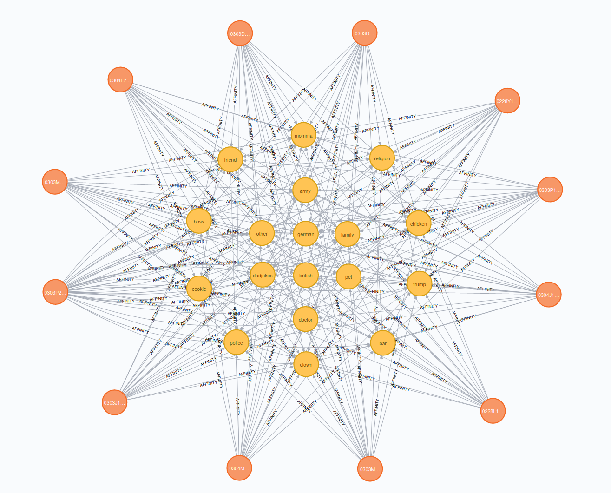

# Neo4j Docker Instance

Contains a supplementary script to deploy a Neo4j Docker instance.

## Installation 

Install Docker >= 19.03.

In the install.sh edit the locations for volume links where to store data and log files:
* /your_location:/data
* /your_location:/logs

Then, run the install.sh script:
```bash

./install.sh

```

The script will automatically build a Docker instance containing Neo4j 3.5 graph database.

It will expose ports:
* 7474 for the web-interface,
* 7687 for the Bolt protocol.

## Running

The installation script will automatically run the instance when it is built.

To stop the instance, run:
```bash
docker stop funboyn4j

```

To start the instance again, execute:
```bash
docker start funboyn4j

```

## Graph-based Ontology

The Funboy ontology is an extended Ravestate ontology, where
* Person type can have an additional AFFINITY relationship
* JokeType is added to represent Nodes labeled after the joke content classes
* AFFINITY relationships contain values which represent scores of jokes' likebility to each Person 

This is the current sub-ontology:



The particular values are located in the subontology.json file which may be used to recreate the values in Neo4j.